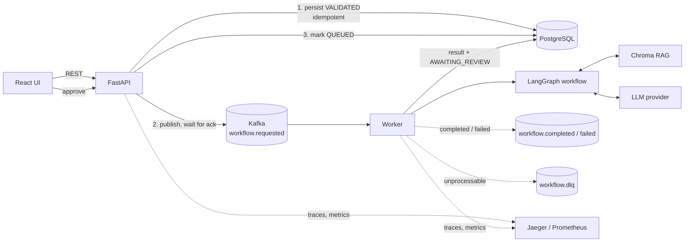

# OpsPilot: Observable AI Workflow Platform

[](https://github.com/ajaykesarwani/opspilot/actions/workflows/ci.yml)

OpsPilot is a local-first reference architecture for **safe, observable LLM workflows**. A user
submits an operational request; the system retrieves relevant policy, drafts a structured
recommendation (or **abstains** when the evidence is weak), and **waits for a human to approve**
before anything is marked complete.

It is built to demonstrate engineering around an LLM rather than the LLM itself: delivery
guarantees, idempotency, failure handling, evaluation gates and tracing.

## Features

| Area | What is implemented | Where to look |
|---|---|---|
| **Typed orchestration** | LangGraph workflow over a Pydantic state: validate → classify → retrieve → draft → validate output (bounded retry) → human review. The graph cannot complete a request itself. | `packages/orchestration` |
| **Abstention** | If no retrieved chunk clears the similarity threshold, the workflow abstains; a model that answers anyway on insufficient evidence is rejected. Citations come from retrieval, never from model output. | `nodes.py`, `store.py` |
| **Reliable messaging** | Kafka with at-least-once processing: offsets are committed only after handling, failed handling is redelivered, poison messages go to a dead-letter topic with reason + source offset. | `packages/messaging`, `services/worker` |
| **Idempotency** | `Idempotency-Key` + payload fingerprint enforced by a PostgreSQL `UNIQUE` constraint (race-safe); the worker detects duplicate deliveries from persisted state. | `routes/requests.py`, `postgres.py` |
| **State machine + audit** | Legal workflow transitions enforced in code and under a row lock; every transition is written to an append-only audit table. | `packages/contracts/workflow.py` |
| **Human-in-the-loop** | `AWAITING_REVIEW → COMPLETED` only via `POST /approve` (409 otherwise). | ADR 0003 |
| **Evaluation** | Golden-dataset evaluation of retrieval + abstention + workflow validity, logged to MLflow, with a **CI regression gate** against a committed baseline. | `services/evaluation` |
| **Observability** | JSON logs with correlation IDs, OpenTelemetry traces propagated API → Kafka → worker → graph nodes (W3C `traceparent` in message headers), Prometheus metrics for API and worker. | `packages/common`, `infra/` |
| **Zero-cost local run** | Deterministic mock LLM and an offline hashing embedder: no API keys. | `llm.py`, `embedder.py` |



**Delivery path.** The request is stored, the event is published and acknowledged by the broker,
and only then is the request marked `QUEUED`. If publishing fails the API returns `503`; retrying
with the same `Idempotency-Key` republishes. Duplicates are harmless because the worker ignores
requests that are already past `QUEUED`. See [ADR 0001](docs/adr/0001-use-kafka-and-at-least-once-processing.md).

## Quick start

Prerequisites: Docker with Compose v2, [uv](https://github.com/astral-sh/uv), Node 22 (only for local frontend work).

```bash
make up            # postgres, kafka, migrations, api, worker, jaeger, prometheus, ui
make demo          # three scripted scenarios (answer + approve, abstain, dead-letter)
```

| Service | URL |
|---|---|
| UI | http://localhost:5173 |
| API docs | http://localhost:8000/docs |
| Jaeger (traces) | http://localhost:16686 |
| Prometheus | http://localhost:9090 (targets: API `/metrics/`, worker `:9100`) |

Kafka is reachable from the host on `localhost:29092`; containers use `kafka:9092`.

## Development

```bash
make install            # uv sync --frozen + npm ci
make lint               # ruff + oxlint
make test               # unit tests (no Docker needed)
docker compose -f infra/docker-compose.yml up -d postgres
make test-integration   # real PostgreSQL + Alembic migrations
make eval               # evaluation with regression gate
make load-test          # throughput + concurrent idempotent-replay check (needs `make up`)
```

CI (`.github/workflows/ci.yml`) runs lint/format, unit + integration tests against a PostgreSQL
service, the evaluation gate, frontend lint + build, and builds every Docker image.

## Evaluation

`make eval` measures the exact pipeline that runs in production (same chunker, embedder and
`DEFAULT_MIN_SCORE`) on 20 golden cases (13 answerable, 7 that must abstain). Current baseline
(`data/knowledge_base/baseline_metrics.json`):

| Metric | Value |
|---|---|
| Recall@k (answerable cases whose source was retrieved) | 0.85 |
| Abstention recall (unanswerable cases correctly abstained) | 0.86 |
| False-abstention rate (answerable cases that abstained) | 0.15 |
| Abstention accuracy (overall) | 0.85 |
| Structured-output validity / workflow completion | 1.00 / 1.00 |

Read these numbers with care: the dataset is small, the threshold was tuned on it (there is no
held-out set), and the embedder is lexical. Questions that need numeric or semantic reasoning
(for example *"Who approves a $100 refund?"*) are the known failures. With the mock LLM, answer
*text* is not graded.

## Known limitations

- **Mock LLM only.** `get_llm_provider()` raises unless `MOCK_MODE=true`; a real provider means
  implementing the `LLMProvider` protocol (structured output + timeouts).
- **Lexical embedder.** `HashingEmbedder` matches words, not meaning. A real embedding model is
  the upgrade path and would need the threshold re-tuned with `make eval`.
- **Knowledge base is per-process.** API and worker each load `data/knowledge_base/*.md` at
  startup into their own in-memory Chroma. `POST /documents/ingest` therefore only affects the
  API process, not the worker. A shared store (Chroma server or pgvector, ADR 0004) fixes this.
- **No authentication.** Anyone who can reach the API can submit and approve; the reviewer is
  recorded as a fixed `human_reviewer`. Add authn/authz before any real use.
- **No transactional outbox.** The publish-then-`QUEUED` sequence plus idempotent retry covers
  broker failures, but a `503` on a request sent *without* an `Idempotency-Key` leaves an orphaned
  `VALIDATED` row.
- **Single broker, single partition, single Postgres.** No replication or high availability;
  scaling workers requires more partitions. Not deployed to any cloud or Kubernetes.

## Documentation

[Runbook](docs/runbook.md) · [Threat model](docs/threat-model.md) · [ADRs](docs/adr) ·
[Demo script](docs/demo-script.md) · [Résumé claims checklist](docs/claims-checklist.md)
